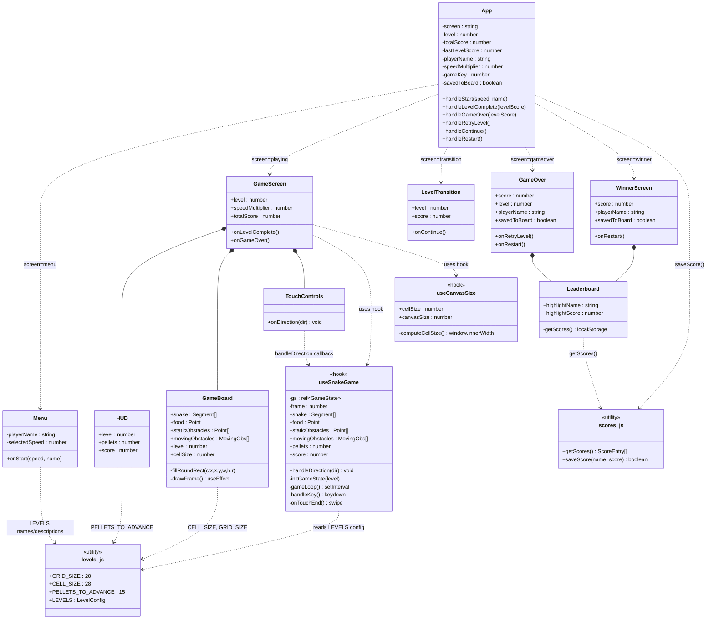
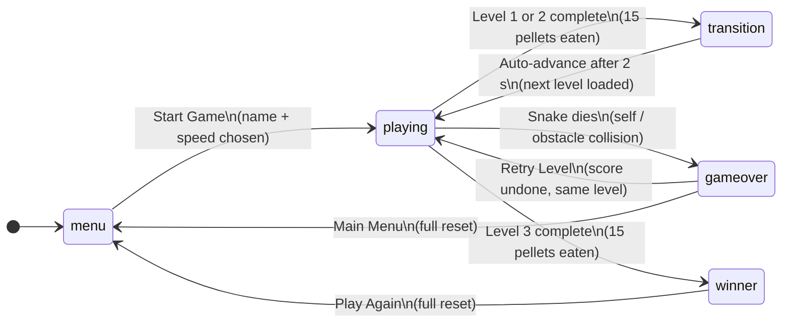
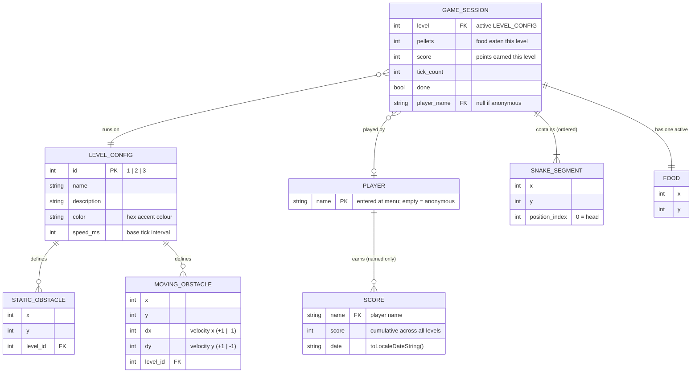

# Snake Game — Architecture, Diagrams & Design Decisions

## Table of Contents

- [Overall Architecture](#overall-architecture)
- [Module by Module](#module-by-module)
- [UML — Component & Architecture Diagram](#uml--component--architecture-diagram)
- [UML — Screen State Machine](#uml--screen-state-machine)
- [ER Diagram](#er-diagram)
- [Design Decisions](#design-decisions)
  1. [Mutable ref for game state](#1-mutable-ref-useref-for-game-state)
  2. [setInterval over requestAnimationFrame](#2-setinterval-over-requestanimationframe)
  3. [gameKey for forced remount](#3-gamekey-integer-for-forced-remount)
  4. [Single monolithic game hook](#4-single-monolithic-game-hook)
  5. [Canvas 2D over DOM or SVG](#5-canvas-2d-over-dom-or-svg)
  6. [Static level config object](#6-static-level-config-object)
  7. [Boundary wrapping instead of wall death](#7-boundary-wrapping-instead-of-wall-death)
  8. [Buffered direction input](#8-buffered-direction-input)
  9. [saveScore returns a boolean](#9-savescore-returns-a-boolean)
  10. [Screen state machine in App](#10-screen-state-machine-in-app)
  11. [Anonymous vs named play](#11-anonymous-vs-named-play)
  12. [Painter's algorithm draw order](#12-painters-algorithm-draw-order)
  13. [Dynamic canvas sizing via useCanvasSize](#13-dynamic-canvas-sizing-via-usecanvassize)
  14. [Three-tier mobile input: D-pad, swipe, keyboard](#14-three-tier-mobile-input-d-pad-swipe-keyboard)
  15. [GitHub Pages deployment via GitHub Actions](#15-github-pages-deployment-via-github-actions)

---

## Overall Architecture

A single-page React app built with Vite. There is no game engine, router, or state management library. The physics loop runs inside a `setInterval` inside a custom hook, the board is painted onto an HTML5 `<canvas>`, and the only persistence layer is a small JSON array in `localStorage`. The app is fully playable on mobile browsers via swipe gestures and an on-screen D-pad, and is deployed to GitHub Pages via a GitHub Actions CI/CD workflow.

```
.github/
 └── workflows/
      └── deploy.yml           ← GitHub Actions: build + deploy to GitHub Pages on push to main
src/
 ├── App.jsx                  ← root: screen state machine + all global state
 ├── App.css                  ← all styles (single flat file, incl. D-pad + responsive rules)
 ├── main.jsx                 ← ReactDOM.createRoot entry point
 ├── hooks/
 │    ├── useSnakeGame.js     ← game physics loop + keyboard + swipe + handleDirection callback
 │    └── useCanvasSize.js    ← responsive cell-size computation (resizes with viewport)
 ├── utils/
 │    ├── levels.js           ← static level config (grid size, obstacles, speeds)
 │    └── scores.js           ← localStorage read/write for top-5 leaderboard
 └── components/
      ├── GameBoard.jsx        ← canvas renderer — accepts dynamic cellSize prop
      ├── TouchControls.jsx    ← D-pad overlay for mobile play
      ├── HUD.jsx              ← level / pellets / score strip above the board
      ├── Menu.jsx             ← start screen: name input + speed picker
      ├── LevelTransition.jsx  ← 2-second between-level splash
      ├── GameOver.jsx         ← death screen: score + leaderboard + retry/menu
      ├── WinnerScreen.jsx     ← win screen: score + leaderboard + play again
      └── Leaderboard.jsx      ← shared top-5 table with highlighted row
```

**Dependency directions:** data flows down as props; events bubble up as callbacks. No component imports another component's sibling. Utility modules (`levels.js`, `scores.js`) are imported by whoever needs them — they carry no React code.

---

## Module by Module

### `hooks/useCanvasSize.js` — Responsive Canvas Sizing

Computes a `cellSize` (pixels per grid cell) that fits the current viewport width, capped at the original 28 px maximum. Re-computes on `resize` and `orientationchange` events.

```
available = min(window.innerWidth − 32, 560)
cellSize  = min(28, max(14, floor(available / GRID_SIZE)))
canvasSize = cellSize × GRID_SIZE
```

Returns `{ cellSize, canvasSize }`. `GameScreen` calls this hook and passes both values down — `canvasSize` as the `game-container` inline width, `cellSize` as a prop to `GameBoard`.

---

### `components/TouchControls.jsx` — D-Pad Input

Renders a 3 × 3 CSS-grid D-pad (up/left/center-pip/right/down) below the game canvas. Each directional button fires `onPointerDown` (fires on both mouse and touch) which calls the `onDirection(dir)` prop immediately — no delay, no `onClick` latency. The center pip is a decorative `<div>`, not a button.

`touch-action: none` and `-webkit-tap-highlight-color: transparent` are applied to every button to suppress browser default touch behaviours.

---

### `utils/levels.js` — Static Configuration

Exports four constants consumed across the codebase:

| Constant | Value | Used by |
|---|---|---|
| `GRID_SIZE` | `20` | hook (wrapping math, obstacle bounds), GameBoard (canvas sizing) |
| `CELL_SIZE` | `28` | GameBoard (pixel math) |
| `PELLETS_TO_ADVANCE` | `15` | hook (win condition), HUD (denominator display) |
| `LEVELS` | object keyed `1\|2\|3` | hook, Menu, HUD, GameOver, LevelTransition |

Each level entry contains: `name`, `description`, `color` (hex accent), `speed` (tick interval in ms), `staticObstacles` (array of `{x,y}`), `movingObstacles` (array of `{x,y,dx,dy}`).

No logic lives here. It is pure data.

---

### `utils/scores.js` — Leaderboard Persistence

| Function | Behaviour |
|---|---|
| `getScores()` | Parses `snake_top_scores` from localStorage; returns `[]` on any failure |
| `saveScore(name, score)` | Checks qualification **before** writing, pushes entry, sorts descending by score, slices to 5, persists; returns `true` if the entry survived the slice |

Persisted shape per entry:
```json
{ "name": "Alice", "score": 450, "date": "2/20/2026" }
```

Only named players are ever written. Anonymous plays leave localStorage untouched.

---

### `hooks/useSnakeGame.js` — The Game Loop

The heart of the application. All mutable game state lives in a single `useRef` called `gs` so the `setInterval` callback can mutate it directly without triggering a React re-render on every tick. A separate `useState(frame)` counter is incremented only when a visual update is needed.

**Initialisation (`initGameState`):** resets snake to a 3-segment horizontal strip at cells (8–10, 10), direction right, deep-clones moving obstacles from the level config, picks a random food cell not overlapping any snake segment or obstacle.

**Each tick — step by step:**

```
1. tickCount++
2. dir ← nextDir              (apply buffered direction)
3. (every 3rd tick) move each moving obstacle;
   bounce off walls and static obstacles by reversing dx or dy
4. newHead = wrap(head + dir)  ((x + GRID_SIZE) % GRID_SIZE)
5. self-collision?             → done, onGameOver
6. static obstacle hit?        → done, onGameOver  (level ≥ 2 only)
7. moving obstacle hit?        → done, onGameOver  (level ≥ 3 only)
8. food eaten?
     yes → grow snake, pellets++, maybe onLevelComplete, respawn food
     no  → slide snake (add head, drop tail)
9. setFrame(f+1)               (trigger re-render)
```

Speed = `Math.round(config.speed * speedMultiplier)` ms. The multiplier (0.6 / 1.0 / 1.6) comes from the Menu and flows in as a prop.

**Input sources (all funnel into `handleDirection`):**

| Source | Mechanism |
|---|---|
| Keyboard | `keydown` listener on `window`; Arrow keys + WASD |
| Swipe | `touchstart` + `touchend` on `window`; fires when delta ≥ 30 px |
| D-pad | `onPointerDown` on `<TouchControls>`; calls `handleDirection` directly |

`handleDirection` is a stable `useCallback` (empty dep array — reads only the stable `gs` ref). It checks the reverse-direction guard and writes `state.nextDir`. The keyboard and swipe effects both depend on `handleDirection` via their effect dep arrays.

---

### `App.jsx` — Screen State Machine

`App` is a pure state router. Its `screen` string drives which subtree is mounted. No screen component needs to know about any other screen.

State owned by `App`:

| State variable | Purpose |
|---|---|
| `screen` | Which UI is visible |
| `level` | Current level number (1–3) |
| `totalScore` | Cumulative score across levels |
| `lastLevelScore` | Score from the most recent level (used to undo on retry) |
| `playerName` | Entered at Menu; empty string = anonymous |
| `speedMultiplier` | Chosen at Menu; persists across levels and retries |
| `gameKey` | Monotonically increasing int; forces GameScreen remount |
| `savedToBoard` | Did this run make the top-5? (set by saveScore return value) |

Score saving happens in the handlers (`handleGameOver`, `handleLevelComplete`), never inside components. Components only receive the result as the `savedToBoard` boolean prop.

---

### `components/GameBoard.jsx` — Canvas Renderer

Purely a side-effect component. Every render fires a `useEffect` that repaints the entire 560×560 canvas from scratch. Draw order (painter's algorithm — back to front):

```
1. Background fill         #0a0a0f
2. Grid lines              #111827, 0.5 px
3. Static obstacles        slate rounded rects
4. Moving obstacles        red rounded rects + orange inner highlight
5. Food                    radial gradient yellow dot + glow halo
6. Snake body              green rounded rects, alpha fades tail→head (0.35→0.9)
7. Snake head              full-brightness green, slightly larger + white glint
```

`fillRoundRect` is a local helper that draws a rounded rectangle using Canvas 2D quadratic curves. The native `roundRect` exists but has inconsistent support across older browsers.

---

### `components/Leaderboard.jsx`

Calls `getScores()` at render time and renders a `<ul>` of up to 5 entries. Rows where `name === highlightName && score === highlightScore` receive `.lb-entry--me` (green glow) and a "you" badge. Medals (🥇🥈🥉) cover ranks 1–3; `#4` and `#5` are plain text.

---

## UML — Component & Architecture Diagram



---

## UML — Screen State Machine



---

## ER Diagram



---

## Design Decisions

Each decision below follows the same structure:
- **What** — the choice made
- **Why** — the reasoning at the time
- **Pros** — what it gains
- **Cons** — what it costs
- **Future heuristic** — the general rule to apply when facing a similar trade-off

---

### 1. Mutable `useRef` for game state

**What:** All in-flight game state (`snake`, `dir`, `food`, `pellets`, `score`, `done`, …) is stored in a single `useRef` object (`gs.current`) that is mutated directly on every tick, rather than stored in React `useState`.

**Why:** A `setInterval` fires ~6–9 times per second. If each tick called `setState` for every change (snake position, obstacle positions, tick counter), React would schedule 6–9 full re-renders per second with vDOM diffing. That is unnecessary overhead for a game loop where every render produces the same kind of output — "redraw the canvas with new positions". The only time a re-render is actually needed is when pixels must change, which is every tick, but triggered by a single lightweight counter: `setFrame(f => f + 1)`.

**Pros:**
- Zero vDOM overhead between the mutation and the repaint
- The interval callback always reads the latest state synchronously (no stale closure problem)
- Mutations are simple imperative assignments — easy to reason about in a sequential loop
- Easy to reset: replace `gs.current` with a fresh object

**Cons:**
- Breaks React's data-flow model — mutations are invisible to React DevTools
- Harder to test in isolation (state is not serialisable without reading `gs.current`)
- Any bug that corrupts `gs.current` is silent until it manifests visually
- Cannot use React's built-in time-travel debugging

**Future heuristic:**

> Ask: "Does React need to *know* about every change, or only the final result?"

Use `useRef` for values that change at a rate React cannot usefully track (animation frames, game ticks, mouse positions in canvas) and where only the **rendered output** matters — not the intermediate states. Use `useState` or `useReducer` when changes must be visible to other components, when you want middleware (logging, undo), or when the React lifecycle must react to each change individually. A useful boundary: **if you would never display the raw value in JSX, a ref is probably fine.**

---

### 2. `setInterval` over `requestAnimationFrame`

**What:** The game loop is driven by `setInterval(tick, intervalMs)` where `intervalMs` varies by level (110–160 ms base, scaled by speed multiplier). `requestAnimationFrame` (rAF) is not used.

**Why:** Snake is a **tile-based, discrete** game. The snake moves exactly one cell per tick; nothing interpolates between frames. rAF fires at ~60 fps (16 ms), which would require manually throttling moves to simulate the 110–160 ms tick rhythm. `setInterval` at the desired interval is a direct, honest expression of the game's cadence. rAF's benefit (smooth animation, sync with display refresh) only matters for games with continuous motion.

**Pros:**
- Interval directly matches game semantics — one tick, one snake move
- No throttle logic or delta-time accumulation needed
- Speed is trivially adjustable by changing the interval value
- Code clearly communicates intent: "do this every N ms"

**Cons:**
- `setInterval` can drift or clamp under CPU pressure (tab is backgrounded, GC pause)
- Firing at 110 ms means the game runs at ~9 fps of logic updates — fine for snake, wrong for smooth animation
- Does not sync to the display's refresh rate, so canvas repaints can tear on very slow ticks

**Future heuristic:**

> Match the loop mechanism to the game's motion model.

| Motion type | Use |
|---|---|
| Continuous (platformer, shooter) | `requestAnimationFrame` + delta time |
| Discrete grid-based (snake, chess, turn-based) | `setInterval` at the logical tick rate |
| Mixed (discrete logic, smooth animation) | rAF loop that accumulates elapsed time and fires logic when threshold exceeded |

---

### 3. `gameKey` integer for forced remount

**What:** `App` maintains a `gameKey` counter. `GameScreen` is rendered as `<GameScreen key={`${level}-${gameKey}`} .../>`. Incrementing `gameKey` causes React to unmount and remount `GameScreen` even when the `level` prop has not changed (e.g. on retry).

**Why:** The alternative is a `reset()` function exposed by the hook, which must carefully re-initialise every piece of state (`gs.current`, the `frame` counter, any pending timeouts). This is error-prone — any new field added to `gs` must also be reset manually. Letting React's own lifecycle handle reset (unmount → mount = guaranteed clean slate) is more reliable and requires no reset logic at all.

**Pros:**
- Guaranteed clean initialisation — React tears down and rebuilds everything
- Zero custom reset logic to write or maintain
- Adding new state to the hook requires no corresponding reset code
- The technique generalises: any component can be hard-reset this way

**Cons:**
- Unmount/mount is slightly more expensive than an in-place reset (creates new DOM node, new event listeners, new `setInterval`)
- The `key` prop is a subtle mechanism — developers unfamiliar with React's reconciliation may be confused
- If `GameScreen` had expensive setup (API calls, complex initialisation), remounting would be costly

**Future heuristic:**

> Prefer remounting over manual reset when:
> - The component has multiple interconnected pieces of state
> - Partial reset carries risk of leaving stale state behind
> - The component is cheap to mount (no network calls, no heavy computation)
>
> Prefer a `reset()` function when:
> - Mounting is expensive (fetches data, loads assets)
> - You want to preserve some state across resets (e.g. keep the score but reset the board)
> - The reset needs to be animated (transition from old state to new)

---

### 4. Single monolithic game hook

**What:** All game logic — initialisation, keyboard handling, the tick loop, collision detection, food spawning, scoring — lives in one hook: `useSnakeGame.js`. It is not split into `useCollision`, `useMovement`, `useFood`, etc.

**Why:** All of these concerns read and write the same `gs.current` object on every tick. Splitting them into separate hooks would require either passing `gs` between them (tight coupling) or duplicating state (divergence risk). At this scale (250 lines), a single file is straightforward to navigate. The operations are sequential steps within one loop, not independently reusable pieces.

**Pros:**
- The tick loop reads as a linear narrative — easy to follow step-by-step
- No inter-hook coordination needed
- Refactoring one step (e.g. changing collision logic) is self-contained
- Fewer files, fewer imports

**Cons:**
- The file would become hard to navigate if the game grew significantly (more obstacle types, power-ups, multiplayer)
- Individual concerns (e.g. collision) cannot be unit-tested in isolation
- A bug anywhere in the hook affects the whole game loop

**Future heuristic:**

> Split when concerns are **independently reusable or independently testable**. Keep together when concerns **share mutable state and always run in sequence**.

A useful smell for splitting: if you find yourself writing "first this hook reads X, then that hook writes X, then this hook reads X again" — that shared X wants to live in one place. A useful smell for splitting: if a logical unit (collision detection) could be tested with a pure function independent of React — extract it as a plain function, not a hook.

---

### 5. Canvas 2D over DOM or SVG

**What:** The game board is a single `<canvas>` element. The snake, food, and obstacles are drawn imperatively with Canvas 2D API calls on every render. The alternative would be rendering each cell as a `<div>` or `<rect>` in the DOM/SVG.

**Why:** The board has 400 cells (20×20). On every tick, up to ~25 snake segments move. Re-rendering 400 DOM nodes or SVG elements, even with React's diffing, is heavier than clearing a canvas and redrawing. Canvas also supports gradients, radial glows, and per-pixel control that would require multiple DOM elements to approximate.

**Pros:**
- Full control over every pixel — gradients, glow effects, anti-aliasing
- One DOM node regardless of board size or snake length
- No vDOM reconciliation overhead for game entities
- Drawing order is explicit (painter's algorithm)

**Cons:**
- Imperative API — harder to read than declarative JSX
- Accessibility is zero by default (canvas is a black box to screen readers)
- Hit-testing (click detection on game entities) requires manual math
- No browser DevTools inspector for individual drawn elements

**Future heuristic:**

> Use Canvas when:
> - Rendering hundreds of moving entities per frame
> - Pixel-level effects (gradients, blur, glow) are needed
> - The visual output is read-only (no user interaction with individual elements)
>
> Use DOM/SVG when:
> - Entity count is low (< ~50)
> - Elements need click/hover events, accessibility, or CSS animations
> - The layout benefits from the browser's reflow (text, flexible sizing)

---

### 6. Static level config object

**What:** All level data (obstacles, speeds, colours) is a plain JavaScript object in `levels.js`, loaded at import time. There is no database, no API call, no dynamic generation.

**Why:** The game has exactly 3 levels whose content is fixed and authored by hand. Introducing dynamic loading (a fetch, a generator function, a database) would add complexity, latency, and failure modes for no benefit. The config is small enough to be inlined and is never modified at runtime.

**Pros:**
- Zero loading time — data is bundled with the JS
- Strongly typed at read time (TypeScript would catch typos at build time)
- Dead-simple to extend: add a key `4:` with the same shape
- Testable: import the object in any test file, no mocking needed

**Cons:**
- Cannot be changed without a code deploy
- Not suitable for user-generated levels or server-driven content
- Large obstacle arrays (e.g. 200 entries) would clutter the source file

**Future heuristic:**

> Use static config when:
> - Content is authored by developers, not users
> - The set of variants is small and stable
> - The app must work offline or with zero latency
>
> Move to dynamic/server-driven config when:
> - Non-developers need to edit content (CMS, admin panel)
> - Variants number in the dozens or more
> - Content must be personalised, A/B tested, or updated without a deploy

---

### 7. Boundary wrapping instead of wall death

**What:** When the snake's head crosses an edge, it re-enters from the opposite side (`((x + dx) + GRID_SIZE) % GRID_SIZE`). Hitting the wall no longer kills the snake.

**Why:** Wall death makes the difficulty of Level 1 almost entirely spatial (stay away from edges) rather than skill-based (avoid yourself). Wrapping shifts the challenge to self-avoidance, which is the core mechanic of snake. It also makes the effective play area feel larger and reduces early frustration for new players.

**Pros:**
- Cleaner difficulty curve — Level 1 teaches self-avoidance, Level 2 adds obstacles, Level 3 adds moving threats
- The board feels boundless — fewer "I died because I ran out of space" moments
- Implementation is one line of modulo arithmetic

**Cons:**
- Wrapping can feel unintuitive for players who expect the classic wall-death rule
- A snake that exits the right edge and re-enters the left can immediately collide with its own tail — a subtle gotcha
- Wrapping removes a spatial constraint that experienced players use to trap the snake into coiling tightly

**Future heuristic:**

> When designing a death condition, ask: "What skill is this testing?" Wall death tests spatial boundary awareness. Self-collision tests path planning. Obstacle death tests route memorisation. Match death conditions to the intended skill per level, not to tradition.

---

### 8. Buffered direction input

**What:** Keyboard presses do not change `dir` immediately. They write to `nextDir`. At the start of each tick, `dir ← nextDir` is applied. Additionally, pressing the exact reverse of the current direction is silently ignored.

**Why:** Without buffering, a player who presses Right then Down in rapid succession before the next tick fires would only register Down — the Right press is lost. Buffering one direction ahead prevents this and feels more responsive. Reverse-direction blocking prevents the snake from immediately colliding with its own neck segment, which would feel like a bug rather than a skill failure.

**Pros:**
- Responsive to fast input — no missed keystrokes within a tick window
- Prevents the neck-collision false-death
- Clean separation: input handling and game logic run on different cycles

**Cons:**
- Only one direction is buffered — a sequence of three rapid presses (e.g. Right, Down, Left) within one tick loses the third input
- The reverse-blocking check compares against `dir` (last applied), not `nextDir` (queued), which can allow a 180° turn if the player is very fast across two ticks

**Future heuristic:**

> For discrete-tick games, always decouple input capture from input consumption. Input arrives asynchronously (event-driven); game logic advances on a clock. A queue (even depth 1) between them smooths the mismatch. For high-speed games where multiple inputs per tick are realistic, use a queue of depth 2 or more.

---

### 9. `saveScore` returns a boolean

**What:** Instead of calling `saveScore` and then separately calling `qualifiesForLeaderboard` to check if the score made the top 5, `saveScore` checks qualification *before* writing and returns `true/false`. The caller uses this return value directly.

**Why:** If `saveScore` did not return a boolean, the natural solution would be to call `qualifiesForLeaderboard(score)` in the GameOver/WinnerScreen component to decide whether to show "New record!". But by the time those components render, `saveScore` has already run and the new score is already in localStorage. So `qualifiesForLeaderboard` would find the score already present and always report `true` — a post-save false positive. Returning the result from `saveScore` itself eliminates the race condition because the check happens at the same moment as the write.

**Pros:**
- Single source of truth — the qualification check and the write are atomic from the caller's perspective
- Eliminates a class of time-of-check/time-of-use (TOCTOU) bugs
- The caller gets the answer it needs in one call

**Cons:**
- The function now has two responsibilities: write and report result (mild violation of single-responsibility)
- Callers that want to check qualification without writing must duplicate the logic

**Future heuristic:**

> Whenever you find yourself calling function A and then immediately querying side-effect-sensitive state to react to what A did, fold the result into A's return value. The pattern "do thing, then ask if thing happened" almost always has a race condition waiting to emerge. Return the outcome from the action itself.

---

### 10. Screen state machine in `App`

**What:** A single `screen` string in `App` (`'menu' | 'playing' | 'transition' | 'gameover' | 'winner'`) controls which component tree is rendered. There is no router (`react-router`), no URL-based navigation, no nested routing.

**Why:** The game has 5 screens with fully defined, finite transitions between them. A URL-based router would add dependencies, complicate the state machine (browser back/forward button would need handling), and expose internal game state (current level, score) in the URL unnecessarily. A simple string switch is readable, debuggable, and sufficient.

**Pros:**
- Zero dependencies — no router library to version or configure
- Transitions are explicit in code — `setScreen('gameover')` is unambiguous
- State machine is fully visible in one file
- Works correctly when the page is embedded in an iframe or opened as a PWA

**Cons:**
- No deep linking — the player cannot bookmark or share a URL to a specific screen
- Browser back button does nothing (may feel wrong to users)
- As screen count grows, the if-chain in App becomes long

**Future heuristic:**

> Use a router when URLs are meaningful to users (they want to share or bookmark states) or when the app has many pages with independent lifecycles. Use a state machine (string switch or XState) when screens are transient game states — the user never types a URL to reach them, and the browser history model does not apply.

---

### 11. Anonymous vs named play

**What:** Players can leave the name field blank to play anonymously. Anonymous play: the leaderboard is displayed (read-only) but no score is written. Named play: if the score makes the top 5, it is written to localStorage.

**Why:** Forcing a name before play adds friction that can deter casual players. Making the leaderboard visible to anonymous players still shows them what they are working toward. Limiting saves to named players keeps the leaderboard meaningful (no "aaaa" spam) and sets a clear opt-in contract: you earn persistence by identifying yourself.

**Pros:**
- Lower barrier to entry — click Start and play immediately
- Leaderboard remains visible and motivating for everyone
- Players control whether their score is persisted (privacy consideration)
- Simple to implement: check `if (playerName)` before calling `saveScore`

**Cons:**
- Anonymous scores are lost on page refresh — no way to reclaim them
- A player who forgets to enter a name may feel cheated of a high score record
- The leaderboard could become dominated by a single player who plays repeatedly

**Future heuristic:**

> Design persistence as an explicit opt-in when:
> - The data has personal significance (name, score)
> - The system is purely client-side (no auth, no server)
> - You want to reduce barrier to entry
>
> Design persistence as mandatory when:
> - The data is necessary for core functionality (login, saved game)
> - You need to attribute actions to a user (multiplayer, audit)

---

### 12. Painter's algorithm draw order

**What:** The canvas is repainted every tick by drawing layers from background to foreground in a fixed order: background → grid → static obstacles → moving obstacles → food → snake body → snake head.

**Why:** Canvas 2D has no concept of z-index or layering — whatever is drawn last appears on top. Establishing a fixed draw order that reflects the logical depth of each element (grid is "behind" everything; the snake head is the most salient element) produces the correct visual hierarchy without any special-casing.

**Pros:**
- Predictable rendering — any element added later simply needs to know where in the sequence it belongs
- Cheap to implement — one pass, no sorting required
- Easy to reason about: "what draws over what" is answered by reading the code top-to-bottom

**Cons:**
- Every tick repaints the entire canvas even if only one element moved (no dirty-region optimisation)
- Adding translucent layers (e.g. a fog-of-war effect) requires careful ordering
- For very large canvases with many entities, full repaints can become a bottleneck

**Future heuristic:**

> For static or low-entity-count scenes, full repaint with fixed draw order is the simplest correct solution. Only introduce dirty-region tracking, offscreen buffers, or layer caching when profiling shows the repaint is measurably slow (use `performance.now()` around the draw call to measure). Optimise rendering last — correctness first.

---

### 13. Dynamic canvas sizing via `useCanvasSize`

**What:** `CELL_SIZE` (28 px) is the maximum, not the fixed, cell size. A `useCanvasSize` hook computes the largest cell size that fits the viewport width minus padding, capped at 28 px and floored at 14 px. It re-runs on `resize` and `orientationchange`. The computed `cellSize` and `canvasSize` are passed down as props.

**Why:** Hardcoding `CELL_SIZE = 28` produces a 560 × 560 canvas that overflows the screen on phones narrower than ~600 px. Scaling the canvas down with CSS (`max-width: 100%; height: auto`) would work for the pixels but break the coordinate system used by `GameBoard` — the canvas `width` and `height` attributes must match the intended pixel resolution or the drawing will be stretched or blurry. The only correct solution is to compute the draw dimensions in JavaScript and set the canvas attributes accordingly.

**Pros:**
- Canvas always pixel-perfect — no CSS scaling artefacts
- The game is fully playable at any viewport width ≥ ~300 px
- Handles device rotation (portrait ↔ landscape) via `orientationchange`
- Game logic (grid coordinates, collision detection) is untouched — only the draw scale changes

**Cons:**
- `cellSize` is now a prop on `GameBoard` instead of a module-level constant — slightly more wiring
- On very small viewports the canvas cells are small (14 px minimum), which can make the food dot hard to see
- `GameBoard`'s `useEffect` dep array now includes `cellSize` and `CANVAS_SIZE`, which re-fires the draw on every resize event

**Future heuristic:**

> Whenever a canvas has a fixed logical resolution that must fit inside a variable-size container, compute the canvas dimensions in JavaScript and set `canvas.width` / `canvas.height` to the computed values — never use CSS `width`/`height` to resize a canvas. CSS scaling of a canvas is equivalent to nearest-neighbour upscaling: it does not increase pixel density, it only stretches existing pixels.

---

### 14. Three-tier mobile input: D-pad, swipe, keyboard

**What:** Three independent input methods all call the same `handleDirection` function. Keyboard handler listens on `keydown`. Swipe handler listens on `touchstart`/`touchend` and fires when the gesture exceeds 30 px. D-pad renders `<button>` elements with `onPointerDown` which fires immediately on first contact (no `onClick` 300 ms delay on older mobile browsers).

**Why:** Mobile browsers have no physical keyboard. Swipe-only controls are fast but imprecise for small movements in crowded grids. A D-pad provides reliable, deliberate input. Swipe remains available as a shortcut for fast players who prefer not to look at buttons. Keyboard support stays for desktop users. All three paths converge on one function so the direction-validation logic (reverse-direction guard) is written exactly once.

**Pros:**
- Each input method is independently usable — mobile players choose swipe or D-pad based on preference
- `handleDirection` is the single source of truth for direction change rules
- `onPointerDown` avoids the ~300 ms tap delay that `onClick` can have on mobile Safari/Chrome without a `touch-action: manipulation` hint
- Adding a fourth input method (e.g. gamepad API) requires only one new wiring call to `handleDirection`

**Cons:**
- The D-pad is visible on desktop where it serves no purpose — hidden via `@media (hover: none) and (pointer: coarse)` would be an option, but the current implementation shows it always as it does not harm desktop UX
- Swipe on the document will interfere if any overlay (modal, scrollable panel) is placed above the game — the 30 px threshold mitigates false triggers from taps but cannot fully prevent them
- `onPointerDown` fires before the browser decides whether the gesture is a scroll — `touch-action: none` on the D-pad buttons is required to prevent scroll-competition

**Future heuristic:**

> For touch-primary games, implement at least two input modalities: one gestural (swipe) and one discrete (on-screen buttons). Funnel all modalities through a single validated setter to avoid duplicating guard logic. Prefer `onPointerDown` over `onClick` for game input to eliminate tap-delay latency. Always pair pointer events with `touch-action: none` on the receiving element to suppress competing browser gestures.

---

### 15. GitHub Pages deployment via GitHub Actions

**What:** A workflow file (`.github/workflows/deploy.yml`) triggers on every push to `main`. It installs Node 20, runs `npm ci` and `npm run build`, uploads the `dist/` folder as a Pages artifact, and deploys it using the official `actions/deploy-pages` action. The Vite `base` option is set to `/snake-game/` (overridable via the `VITE_BASE` environment variable) so all asset paths in the built HTML are relative to the repository sub-path.

**Why:** GitHub Pages serves static files from a repository's `gh-pages` branch or a dedicated artifact. Because Vite generates absolute asset paths by default (`/assets/index.js`), they resolve to the root domain rather than the repo sub-path, producing 404s. Setting `base` in `vite.config.js` rewrites all asset URLs to the correct sub-path at build time. GitHub Actions automates the build-and-deploy cycle so the live site stays in sync with `main` without manual intervention.

**Pros:**
- Zero-cost hosting on `github.io` — no server, no CDN subscription
- Deployment is fully automated — a `git push` is the only step required
- The `concurrency: cancel-in-progress: true` setting prevents stale deploys from finishing after a newer push
- `VITE_BASE` environment variable allows the same workflow to serve different repo names without editing source files

**Cons:**
- GitHub Pages serves static files only — no server-side logic, no WebSockets, no persistent backend
- The `base` path must match the repository name exactly; a mismatch causes silent 404s on all assets
- `localStorage` leaderboard data is per-origin and per-browser — scores do not persist across devices or browsers, and there is no shared leaderboard
- Deploying to a custom domain requires additional DNS configuration and a `CNAME` file in `dist/`

**Future heuristic:**

> When deploying a Vite SPA to a path-prefixed static host (GitHub Pages, S3 sub-folder, Netlify sub-path), always set `base` in `vite.config.js` to match the deployment path. Verify the built `index.html` references assets with the correct prefix before deploying. If the prefix must be dynamic (different per environment), drive it from an environment variable at build time rather than hardcoding it in source.
